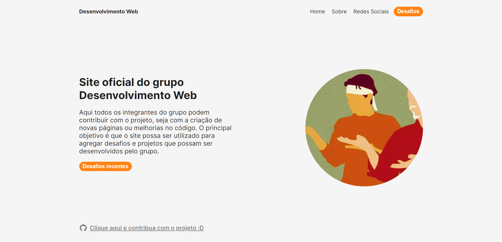

# DesenvolvimentoWeb Desafios

Esse é um projeto onde temos como objetivo divulgar desafios para o grupo 'Desenvolviment Web' e também receber soluções.

## Tabela de conteudo

- [Visão geral](#visao-geral)
  - [Screenshot](#screenshot)
  - [Links](#links)
  - [Como contribuir com o projeto](#como-contribuir)
  - [Como rodar o projeto local](#como-rodar)
- [Tecnologias](#tecnologias)
  - [Construido com](#construido-com)

## Visao-geral

### Screenshot

### Links

- Live Site URL: [Vercel live](https://desenvolvimento-web-oficial.vercel.app)
- Grupo no Discord: [Discord](https://discord.gg/PjpYsPhtpx)
- Grupo no WhatsApp: [WhatsApp](https://chat.whatsapp.com/Ht1EFiTkPngIBnGTMVffQP)

### Como contribuir

Começa dando uma olhada nas issues, escolha algo para você fazer e entre em alinhamento com o criador dela...
- Crie um fork para você
- Faça suas contribuições
- Manda um pull request
Apos analise sua contribuição será mandada para o repositorio :)

### Como rodar
- Certifique-se de estar usando o node em uma versão entre 16.15.0 e 17.0.0
- Faça um "git clone" do projeto para uma pasta local
- Rode o comando "yarn" para instalar dependencias do projeto
- Para rodar o servidor local utilize "yarn dev" 
- O projeto será aberto no em "http://localhost:3000"

## Tecnologias

### Construido com

- React
- Next.js
- TypeScript
- JavaScript
- Node.js
- Styled Components
- HTML
- CSS